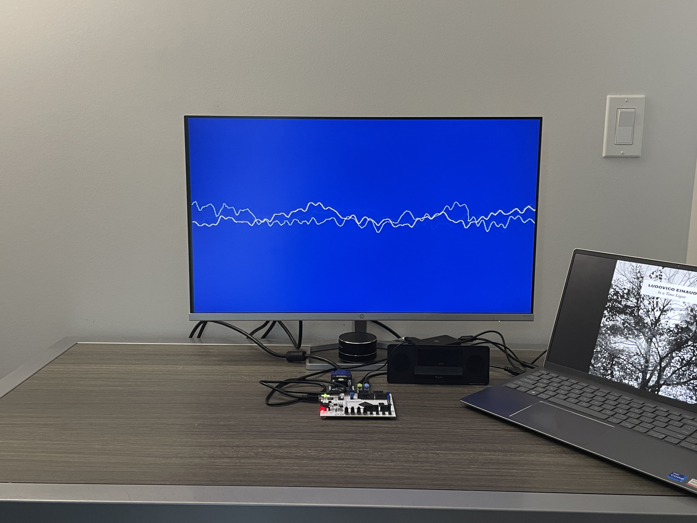
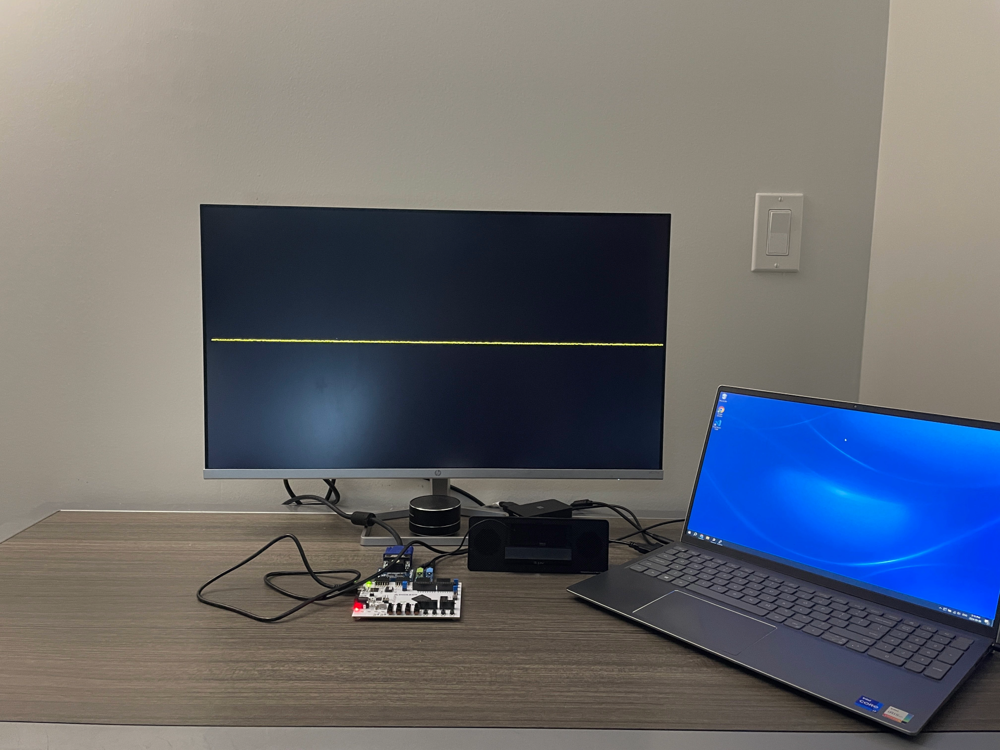
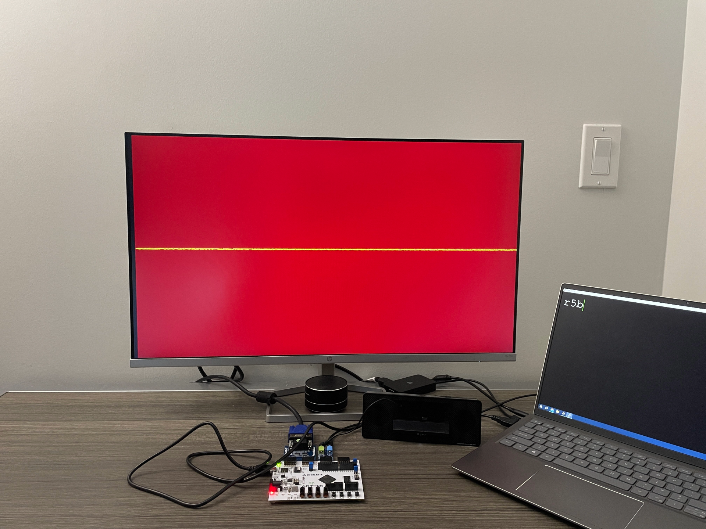

# FPGA Real-Time Audio Visualizer

A real-time audio waveform visualizer targeting the Xilinx Spartan-7 FPGA.

## Hardware Used

- The design targets the Digilent Arty S7-50 FPGA board, which features an Xilinx Spartan-7 FPGA
- The Digilent PMOD I2S2 was used to receive and transmit I2S data
- The Digilent PMOD VGA was used to display the waveform out of VGA

## Software Used

- Vivado was used to synthesize and implement the design
- A combination of XSim and Icarus Verilog were used to simulate the design
- All testbenches and custom IP were designed in Verilog
- A golden-model of the design was developed in Python, which was used to generate expected inputs and outputs to verify the behaviour of the design

## User Flow

1. Connect the PMOD I2S2 Line In to a 3.5mm audio input device (e.g. a PC or smartphone)
2. Connect the PMOD I2S2 Line Out to a 3.5mm audio output device (e.g. speakers or headphones)
3. Connect the PMOD VGA to a VGA-capable monitor
4. Download the bistream to the FPGA board using Vivado, which, once complete, will display the following waveform:
   
5. At this point, audio can be played using the input device, and the time-domain waveform of the audio will be displayed on the monitor.
6. To change the colour of the waveform or background, open a serial terminal (e.g. puTTy) on the input device
7. Input "r", "g", or "b" to select the channel to edit. The RGB LEDs on the board will light up in the colour you are currently editing:
   
8. Choose an intensity, specified as a hexadecimal digit. Valid values range from 0 to f:
   
9. Choose either "b" to change the background, or "w" to change the waveform colour:
   
10. The same steps can be followed to edit the colour of the waveform as well
11. Play audio and watch as the waveform changes throughout the song! You can also edit the colours while audio is playing.

Some of my personal favourite colour schemes are
| Background | Waveform | Description |
| ---------- | -------- | ----------- |
| (0, 2, 6) | (f, f, f) | A white waveform on a blue background |
| (2, 0, 3) | (f, 0, 9) | A neon-pink waveform on a dark-purple background |
| (1, 7, 0) | (f, f, 0) | A yellow waveform on a dark-green background |

